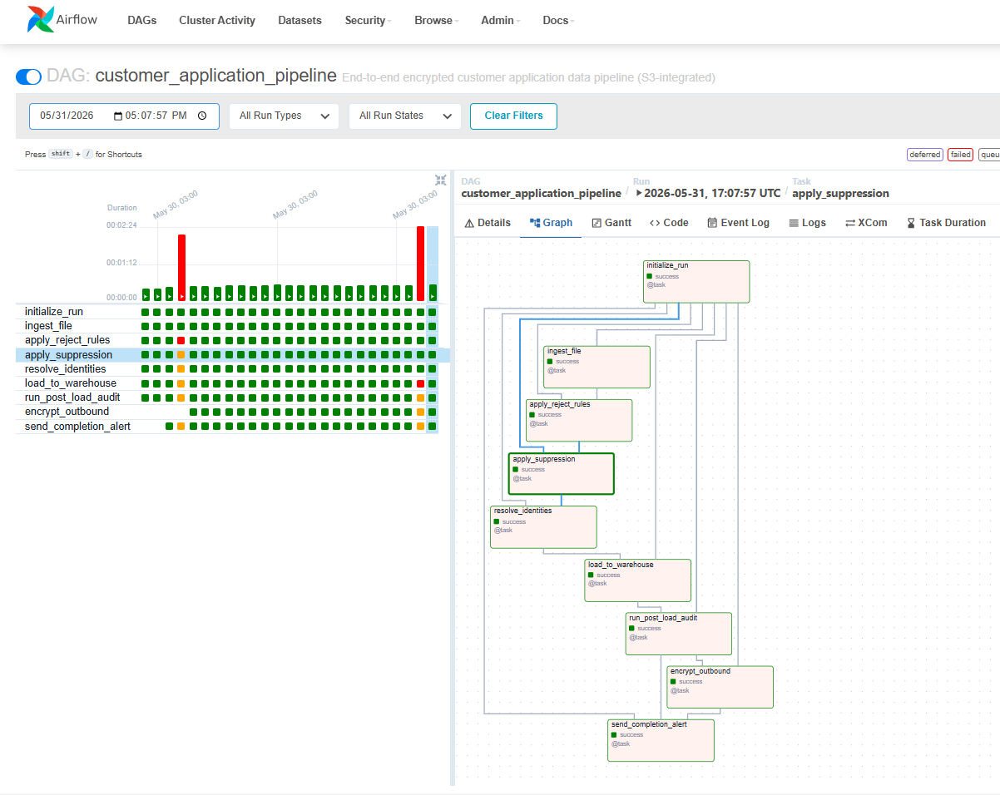
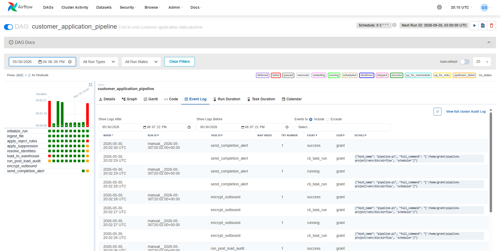
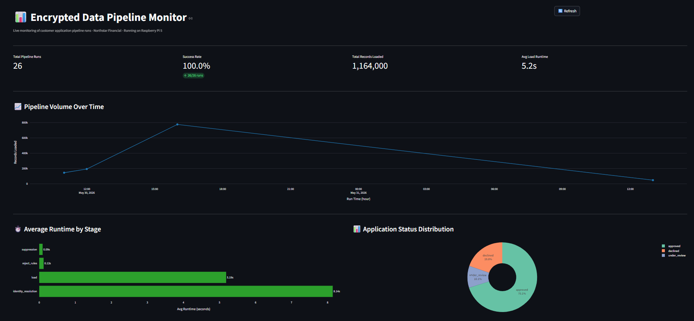
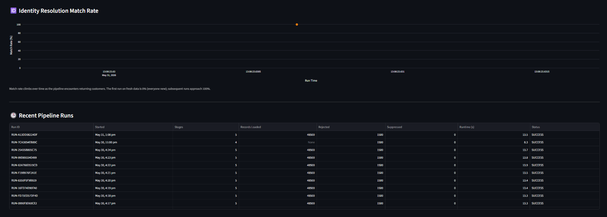
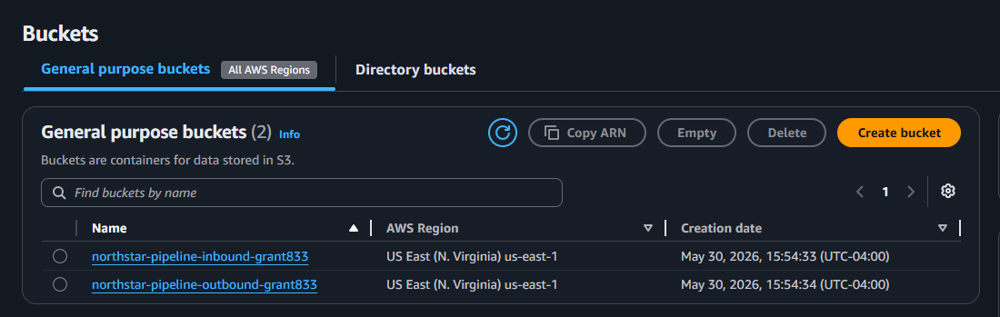
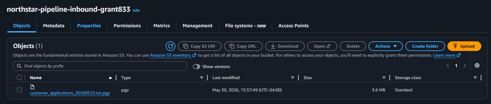
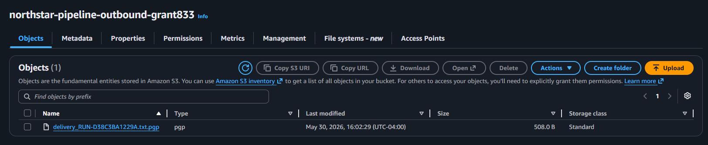
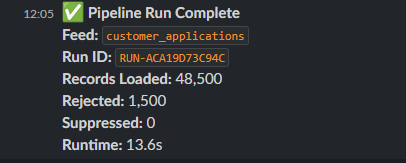
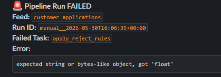

# Northstar Encrypted Data Pipeline

An end-to-end PGP-encrypted data pipeline running 24/7 on a Raspberry Pi 5, modeled after enterprise consumer-finance data infrastructure. Encrypted files flow from S3 inbound buckets through nine processing stages — decryption, validation, privacy suppression, identity resolution, warehouse load, audit, outbound encryption, and alerting — orchestrated by Apache Airflow on a daily schedule, with live operational metrics on a Streamlit dashboard and success/failure pings to Slack.

> All records are synthetically generated using the `faker` library. No real PII anywhere. "Northstar Financial" is a fictional company that does not exist.

---

## Architecture

A single Raspberry Pi 5 runs PostgreSQL, Airflow (scheduler + webserver), and Streamlit as systemd-managed services. External integrations cover the full encrypted I/O loop: AWS S3 for inbound/outbound file transfer, Slack for operational alerting, and GPG for end-to-end encryption.

See [`docs/architecture.pdf`](docs/architecture.pdf) for the full system diagram and per-task breakdown.

---

## How it works

A file arrives encrypted as a `.pgp` in the S3 inbound bucket. Airflow's scheduler triggers the DAG (daily at 3am UTC, or manually). The pipeline downloads the file, decrypts it with the inbound private key, parses it into a pandas dataframe, and runs it through nine orchestrated tasks: validation against reject rules, suppression against privacy and fraud watchlists, identity resolution via SHA-256 hash matching, bulk-load to the PostgreSQL warehouse, and a battery of audit queries. A delivery summary is built, encrypted with the vendor's public key, and uploaded to the outbound S3 bucket. A formatted success or failure message is posted to Slack. The Streamlit dashboard reads from the audit log every 30 seconds and renders live metrics.

### Airflow DAG

The DAG visible above shows all 9 tasks of `customer_application_pipeline`. The grid view on the left captures real run history — successful runs as green columns, failed runs in red, retries in yellow.

Per-task drill-downs include logs, timing, and an event log showing every task transition over the lifetime of the DAG.

### Live monitoring dashboard

A Streamlit dashboard reads from `pipeline_audit_log` every 30 seconds, presenting live metrics for total runs, success rate, records loaded, average runtime, and a per-stage performance breakdown.

Below the top-line metrics, the dashboard surfaces identity resolution match rate over time (climbs from 0% on day one to ~100% as returning customers are recognized) and a sortable table of recent pipeline runs.

### S3 inbound and outbound buckets

Two S3 buckets handle file transfer with all public access blocked. The inbound bucket receives encrypted feeds from the simulated vendor; the outbound bucket receives delivery confirmations encrypted with the vendor's public key.

### Slack operational alerts

Every pipeline run posts a formatted status message to Slack — success messages include records loaded, rejected, suppressed, and total runtime. Failures include the failed task name and the underlying exception.

---

## Tech stack

Python 3.13 · PostgreSQL 17 · Apache Airflow 2.11 · GPG/PGP · AWS S3 (boto3) · Slack SDK · Streamlit · Plotly · pandas · SQLAlchemy · pytest · systemd

Running on a Raspberry Pi 5 (8GB) in Atlanta, Georgia. All services managed by systemd — survives reboots, auto-restarts on crash.

---

## Project structure

- `dags/` — Airflow DAG (`customer_application_pipeline`)
- `pipeline/` — Core modules:
  - `encryption.py` — GPG decrypt/encrypt wrappers
  - `reject_rules.py` — validation rules engine
  - `suppression_engine.py` — privacy + fraud filtering
  - `identity_resolution.py` — SHA-256 hash matching
  - `loader.py` — Postgres bulk insert
  - `audit.py` — post-load audit queries + volume anomaly detection
  - `alerting.py` — Slack success/failure messages
  - `s3_utils.py` — S3 upload/download helpers
- `sql/` — schema.sql + audit_queries.sql + seed data
- `dashboard/` — Streamlit live monitoring dashboard
- `data_gen/` — Synthetic data generator + S3 upload script
- `tests/` — 45 pytest unit tests
- `ops/systemd/` — systemd service files for reproducibility
- `docs/` — architecture PDF + screenshots

---

## Pipeline DAG (9 tasks)

`initialize_run` → `ingest_file` → `apply_reject_rules` → `apply_suppression` → `resolve_identities` → `load_to_warehouse` → `run_post_load_audit` → `encrypt_outbound` → `send_completion_alert`

Each task writes its output to a temp parquet file and passes the path via XCom — avoids serializing large dataframes through Airflow's metadata database.

---

## Build status

- [x] Phase 0 — Raspberry Pi 5 setup
- [x] Phase 1 — Software stack (Python, Postgres, Airflow, Git, GPG)
- [x] Phase 2 — AWS S3 (real inbound and outbound buckets)
- [x] Phase 3 — GPG encryption (end-to-end, two key pairs)
- [x] Phase 4 — Synthetic data generator (50K records per file via faker)
- [x] Phase 5 — PostgreSQL schema (8 tables, seeded suppression data)
- [x] Phase 6 — Reject rules engine (9 rules, 9 passing tests)
- [x] Phase 7 — Suppression engine (8 passing tests)
- [x] Phase 8 — Identity resolution (SHA-256 hash matching, 12 passing tests)
- [x] Phase 9 — Warehouse loader (SQLAlchemy Core bulk insert, 6 passing tests)
- [x] Phase 10 — Audit layer (stage-level logging + volume anomaly detection, 8 passing tests)
- [x] Phase 11 — Airflow orchestration (TaskFlow API, systemd-managed)
- [x] Phase 12 — Streamlit dashboard (live metrics, systemd-managed)
- [x] Phase 13 — Slack alerts (success + failure callbacks)
- [ ] Phase 14 — Docker (deferred)
- [x] Phase 15 — Architecture documentation + screenshots + README

---

## Running it

This pipeline is built to run on a specific Pi setup. The Pi runs four services (Postgres, Airflow scheduler, Airflow webserver, Streamlit) as systemd units. To reproduce the environment on another Pi or Linux box:

1. Clone the repo, create a Python venv, `pip install -r requirements.txt`
2. Install PostgreSQL 17, create `pipeline_db` and `airflow_db` databases
3. Load the schema: `psql -d pipeline_db -f sql/schema.sql`
4. Set up GPG keys for inbound and vendor identities (see `docs/architecture.pdf`)
5. Create S3 buckets and IAM user
6. Copy `.env.example` to `.env` and fill in your credentials
7. Initialize Airflow: `airflow db migrate`, then `airflow users create ...`
8. Install systemd units from `ops/systemd/`
9. Trigger the DAG: `airflow dags trigger customer_application_pipeline`

---

## Tests
pytest tests/ -v

45 tests across reject rules, suppression, identity resolution, loader, and audit modules. All pass.

---

## Author

Grant Shimer
